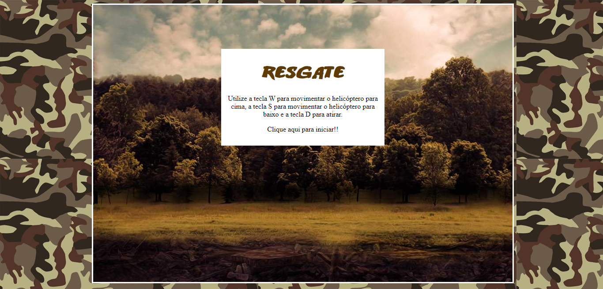

<h1 align="center">🎮 Resgate 🎮</h1>

<h3 align="center">Projeto do game resgate desenvolvido no Bootcamp Front-End da DIO.</h3>

 

  

    

Acesse o projeto [aqui](https://fel1324.github.io/Game-Resgate/)

---

## ✨ Tecnologias

* HTML e CSS
* Javascript
* Git e Github

 

## 🕹️ Projeto

O projeto é um jogo no qual o jogador controla um helicóptero com a missão de resgatar aliados e atacar helicópteros e caminhões inimigos. Ao resgatar aliados e destruir inimigos, o jogador acumula pontos. O jogo termina quando o helicóptero do jogador é destruído três vezes, momento em que o total de pontos conquistados é exibido.

 

## 📋 Licença

Esse projeto está sob a licença MIT.
